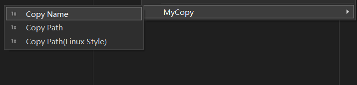

# MyCopyExtensionVs

Add copy feature for all items within the solution explorer.

(https://github.com/hxbb00/MyCopyExtensionVs)

## Features

- Copy the name of a file in the solution explorer
- Copy the path of a file in the solution explorer

## Snapshots

  

## License

[Apache 2.0]
